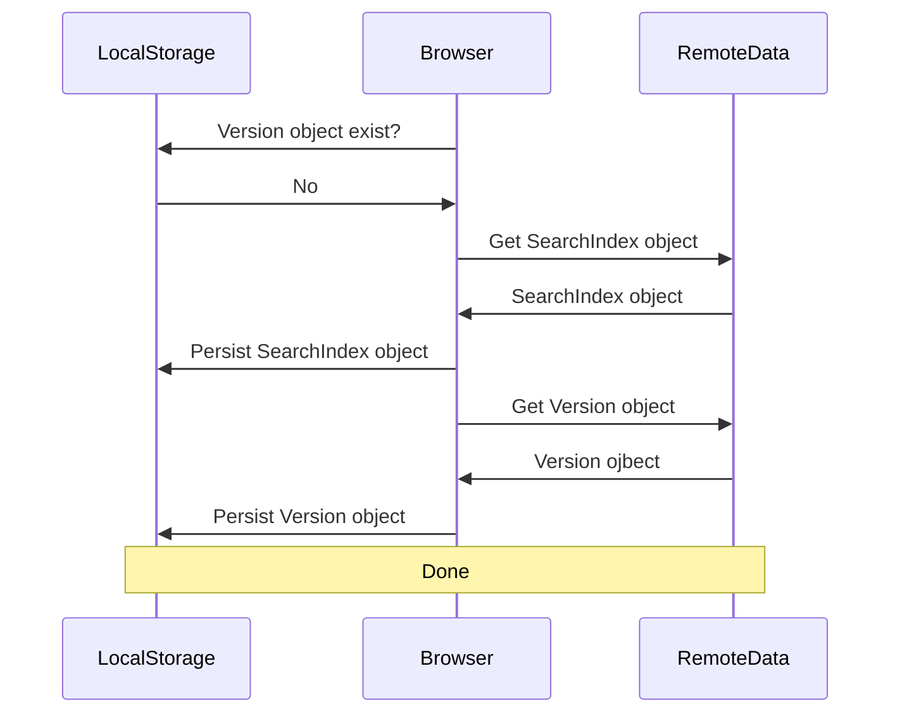
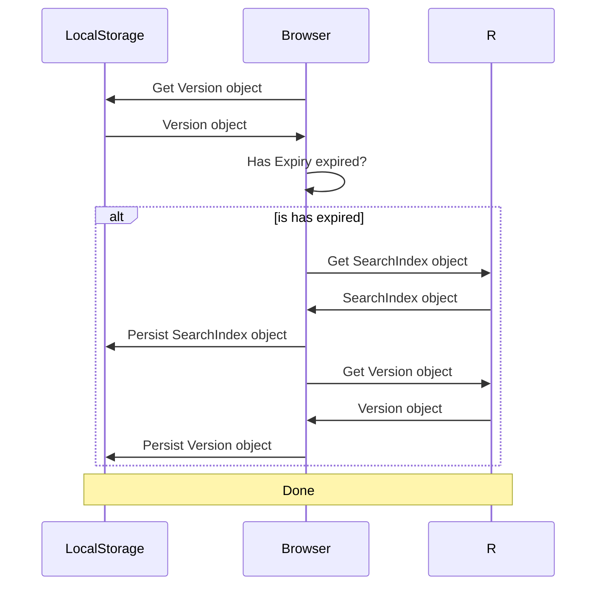
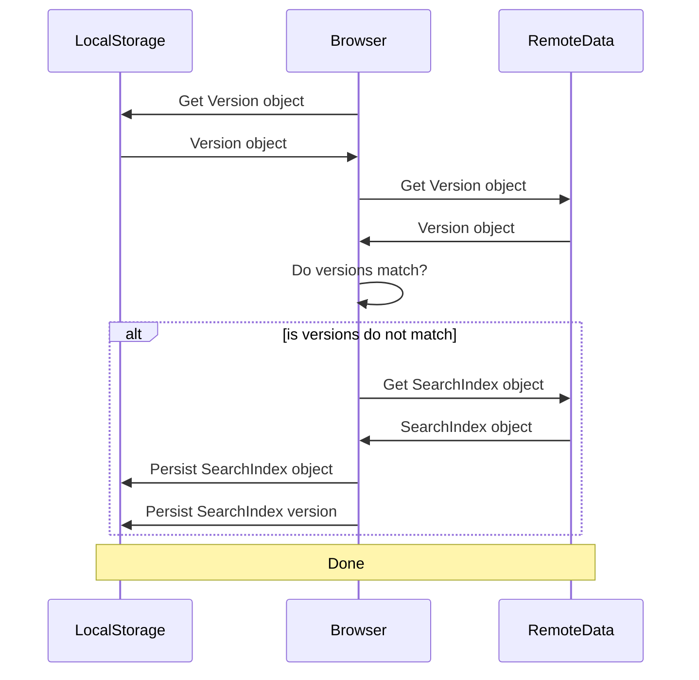

# Site Search

## Overview

The Central Supply Catalog site search is based upon the [minisearch](https://github.com/lucaong/minisearch) Javascript library. This library produces a small, fast index in JSON format that includes features such as fuzzy search, filters, etc. The search feature uses an index built from the product data entries and is updated whenever the index file is modified.

## Requirements

### Functional Requirements

[Func1] Provide a full-text search capability
[Func2] Provide the capablity to display the search results
[Func3] Provide the capability to paginate the search results display
[Func3] Provide the capability to persist the search index locally
[Func4] Provide the capability to update the search index when it is changed on the server
[Func5] Provide the capability for the user to force a refresh of the search index

# Analysis

The product data entries consist of the following format:

| Element     | Description                                                                                |
| ----------- | ------------------------------------------------------------------------------------------ |
| sku         | Unique identifier for element.                                                             |
| category    | The category of the product                                                                |
| type        | The type of the product. Often this will be the same as the category                       |
| subtype     | A further definition of the type of product                                                |
| name        | The name of the product                                                                    |
| cost        | The cost of the product                                                                    |
| mass        | The mass of the product in kilograms                                                       |
| size        | the size of the object                                                                     |
| techLevel   | The initial technology level where the product becomes available                           |
| qrebs       | The measure of **Q**uality, **R**eliability, **E**ase of Use, **B**urden, and **S**afety   |
| image       | url of image file                                                                          |
| description | Full-text description of item                                                              |
| sources     | A collection of objects that provide the author / publication attributions for the product |
| accessories | A collection of skus to related products                                                   |
| tags        | A collection of labels used by the Eleventy system to create custom collections            |

For the purposes of the search index, the relevant fields to include in the index entry are:

- cost
- description
- name
- sku
- subtype
- techLevel
- type

The fields that should be indexed are:

- description
- name
- category (department)
- subtype
- type
- image

These fields should encompass the requisite data for the site search.

Fields that need to be in the index for filtering purposes are:

- cost
- mass
- qrebs
- size
- techLevel

Fields that can be excluded from the index are:

- accessories
- tags

Minisearch relies upon a unique _id_ element. This element can apparently be anything so long as it is unique. The majority of the site functionality uses the sku as the unique identifier, but for the purposes of the search index, it is more reasonable to inject an artifical numeric id. The rationale is that the search index is generated to a JSON object and persisted to disk on the site. In turn the browser application must download the search index so it is desireable to minimize the size of the search index as much as possible.

With this in mind, the total number of catalog items is not anticipated to exceed 99,999 which results in a maximum of five bytes storage whereas a sku is 13 bytes every time so saving 8 bytes, while not a considerably large savings for a single retrieval becomes more important as the number of users increase. This constraint is also due to the bandwidth and storage limits imposed by Github Pages. Ergo sum, every little bit helps.

## Design

The minisearch library will be included into the web application by using the following CDN link:

```html
<script src="https://cdn.jsdelivr.net/npm/minisearch@3.0.4/dist/umd/index.min.js"></script>
```

Should the CDN link fail at some point in the future, the libraries will be installed locally in the _src/js_ directory.

The resulting search index will be stored in the \data folder as an uncompressed text file containing a JSON array. The file is not be compressed as the underlying assumption is that the Github Pages web server has compression turned on.

The input data for the index is stored in a collection of files in the \data directory that will not be copied to the production \data folder. The _products-manifest.json_ file contains a list of the data files for the indexer to use as its input.

The search results will be overlaid on the home page in place of the departments container.

Each product result will have the same layout that is used by the product display for the department page. This will include the following elements:

- Product Image
- Product Name (as a hyperlink to the product page)
- Product Summary
- Product Cost

The search results will provide a pagination feature should the number of results exceed 10. The results will be organized into groups of 10.

To support the "auto-update" feature, a sentinel file with a version number will be created in the \data directory. The version number will be persisted in local storage so that it can be used to determine whether or not a new version of the index has been generated. The version object will have the following data:

| Data    | Description                            |
| ------- | -------------------------------------- |
| version | Numeric version number (integer value) |
| expiry  | Expiration date                        |

The auto-reload feature will check the version object in localstorage to see if the expiry date has expired. If it has, the feature will retrieve the version object from the remote site to see if the version has changed. Regardless, the expiry date will be updated by one hour. If the version has changed, then the feature will load the new version of the search index and store it into localstorage (See the call flow diagrams below).

### Call Flows

#### Use Case 1 - Search Index not stored locally



---

#### Use Case 2 - Search Index Stored locally



---

#### Use Case 3 - Search Index is stored locally



---
