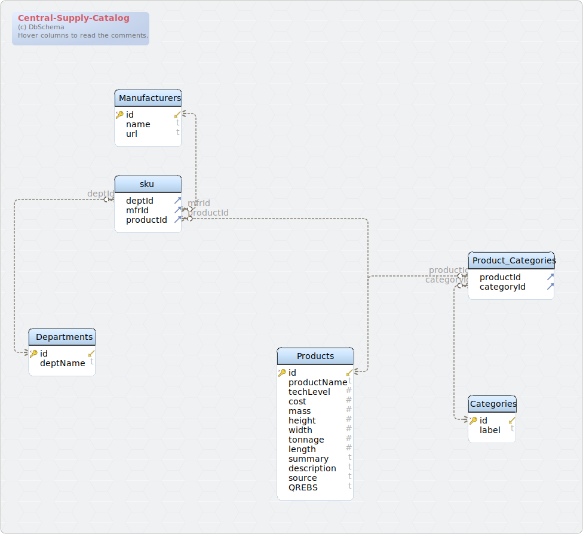

#Central-Supply-Catalog

### [Default Layout](/!)

## Tables

1. [Tables](#tables)
  1. [Table Categories](#table-categories)
  2. [Table Departments](#table-departments)
  3. [Table Manufacturers](#table-manufacturers)
  4. [Table Product_Categories](#table-product_categories)
  5. [Table Products](#table-products)
  6. [Table sku](#table-sku)

### Table Categories 
| Idx | Field Name | Data Type | Description |
|---|---|---|---|
| *🔑 ⬋ | <a name='Default.Categories_id'>id</a>| integer  | Category Id |
|  | <a name='Default.Categories_label'>label</a>| text  | Category label |
| Indexes |
| 🔑 | Pk&#95;Categories&#95;id || ON id |  |

### Table Departments 
| Idx | Field Name | Data Type | Description |
|---|---|---|---|
| *🔑 ⬋ | <a name='Default.Departments_id'>id</a>| integer  | Department id &#40;three characters&#41; |
|  | <a name='Default.Departments_deptName'>deptName</a>| text  |  |
| Indexes |
| 🔑 | Pk&#95;Departments&#95;id || ON id |  |

### Table Manufacturers 
| Idx | Field Name | Data Type | Description |
|---|---|---|---|
| *🔑 ⬋ | <a name='Default.Manufacturers_id'>id</a>| integer  | Manufacturer ID |
|  | <a name='Default.Manufacturers_name'>name</a>| text  | Name of the manufacturer |
|  | <a name='Default.Manufacturers_url'>url</a>| text  |  |
| Indexes |
| 🔑 | Pk&#95;Manufacturers&#95;id || ON id |  |

### Table Product_Categories 
Intersection table for products and categories

| Idx | Field Name | Data Type | Description |
|---|---|---|---|
| ⬈ | <a name='Default.Product_Categories_productId'>productId</a>| integer  |  |
| ⬈ | <a name='Default.Product_Categories_categoryId'>categoryId</a>| integer  |  |
| Foreign Keys |
|  | fk_product_categories_products | ( productId ) ref [Default&#46;Products](#Products) (id) |  |
|  | fk_product_categories | ( categoryId ) ref [Default&#46;Categories](#Categories) (id) |  |

### Table Products 
Displacement volume in metric tons&#46; &#40;Vehicles only&#41;

| Idx | Field Name | Data Type | Description |
|---|---|---|---|
| *🔑 ⬋ | <a name='Default.Products_id'>id</a>| integer  | Product id |
|  | <a name='Default.Products_productName'>productName</a>| text  | Full name of product |
|  | <a name='Default.Products_techLevel'>techLevel</a>| integer  | Minimum technology level |
|  | <a name='Default.Products_cost'>cost</a>| integer  | Cost of the item in Imperial credits |
|  | <a name='Default.Products_mass'>mass</a>| integer  | Mass of the product in kilograms |
|  | <a name='Default.Products_height'>height</a>| real&#40;10&#44;3&#41;  | Height in centimeters |
|  | <a name='Default.Products_width'>width</a>| real&#40;10&#44;3&#41;  | Width in centimeters |
|  | <a name='Default.Products_tonnage'>tonnage</a>| real&#40;10&#44;3&#41;  |  |
|  | <a name='Default.Products_length'>length</a>| real&#40;10&#44;3&#41;  | Length in centimeters |
|  | <a name='Default.Products_summary'>summary</a>| text  | Short summary for search results page |
|  | <a name='Default.Products_description'>description</a>| text  | Complete product description |
|  | <a name='Default.Products_source'>source</a>| text  | Cite the source of the product &#40;author&#44; publication&#44; web site&#44; etc&#46;&#41; |
|  | <a name='Default.Products_QREBS'>QREBS</a>| text  | Quality of the item &#40;QREBS&#41; |
| Indexes |
| 🔑 | Pk&#95;Product&#95;id || ON id |  |

### Table sku 
Interesect of department id&#44; manufacturer id&#44; product id

| Idx | Field Name | Data Type | Description |
|---|---|---|---|
| ⬈ | <a name='Default.sku_deptId'>deptId</a>| integer  | Department id from depart |
| ⬈ | <a name='Default.sku_mfrId'>mfrId</a>| integer  | Manufacturer id |
| ⬈ | <a name='Default.sku_productId'>productId</a>| integer  |  |
| Foreign Keys |
|  | fk_sku_departments | ( deptId ) ref [Default&#46;Departments](#Departments) (id) |  |
|  | fk_sku_manufacturers | ( mfrId ) ref [Default&#46;Manufacturers](#Manufacturers) (id) |  |
|  | fk_sku_products | ( productId ) ref [Default&#46;Products](#Products) (id) |  |

